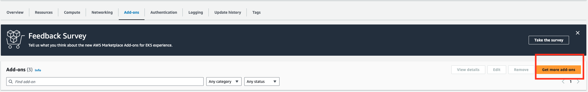
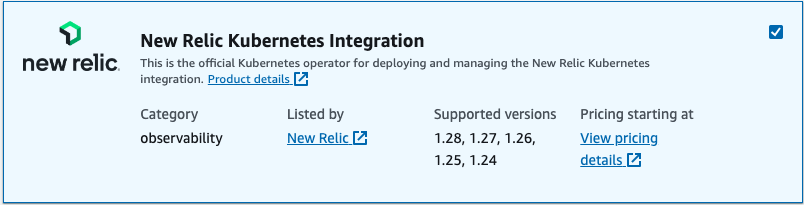
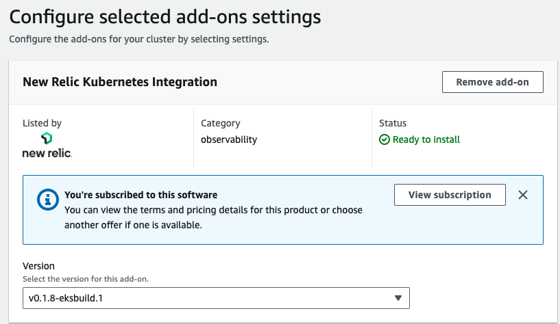

# New Relic Kubernetes Operator from AWS Marketplace

This document shows the steps required to use EKS AddOn from AWS Marketplace.

**NOTE : This addon is currently supported only on X86 instance types and the support for ARM64 architecture type is coming soon**

## Pre-Requisites

1. [Amazon Elastic Kubernetes Service (EKS)](https://docs.aws.amazon.com/eks/latest/userguide/what-is-eks.html) Cluster. See the userguide [here](https://docs.aws.amazon.com/eks/latest/userguide/create-cluster.html)
2. A valid [New Relic](https://one.newrelic.com/). You can subscribe to New Relic from AWS Marketplace with Free Tier. See details [here](https://aws.amazon.com/marketplace/pp/prodview-ov56chowabeb4?sr=0-3&ref_=beagle&applicationId=AWS-Marketplace-Console)
3. Subscribe to [New Relic Kubernetes Integration](https://aws.amazon.com/marketplace/pp/prodview-gcywa6keq2ajy?applicationId=AWS-Marketplace-Console&ref_=beagle&sr=0-5), available for free
4. Login to [New Relic](https://one.newrelic.com/) and generate a [License Key](https://one.newrelic.com/launcher/api-keys-ui.api-keys-launcher)


## Provision New Relic Kubernetes Operator EKS AddOn via AWS console

1. Navigate to the EKS Cluster > Add-Ons > **Get More add-ons**



2. Under **AWS Marketplace add-ons**, search, browse or navigate to **New Relic Kubernetes Integration** , check mark against the result and click **Next**



3. Select the latest default version or any pinned down version of your interest and click **Next**



6. Click **Create**

Within few minutes, New Relic's Kubernetes Operator would be up and running. Please view the configuration steps below to collect and ship observability data from your EKS Cluster to New Relic.

## Provision Kong Gateway EKS AddOn via AWS Command Line Interface (CLI)

1. Execute the following command to install the Kong AddOn

```
aws eks create-addon --cluster-name REPLACE_ME --addon-name new-relic_kubernetes-operator
```

where 

**--cluster-name** : Name of your EKS Cluster

**Expected Output**

Output will be similar to following

```
{
    "addon": {
        "addonName": "new-relic_kubernetes-operator",
        "clusterName": "newrelic-test",
        "status": "CREATING",
        "addonVersion": "v0.1.8-eksbuild.1",
        "health": {
            "issues": []
        },
        "addonArn": "arn:aws:eks:ap-northeast-2:292226546026:addon/kubecon2023-127/new-relic_kubernetes-operator/6cc5e7b7-d8f1-5fa0-c668-2bc9727e16b3",
        "createdAt": "2023-07-27T11:47:57.023000-07:00",
        "modifiedAt": "2023-07-27T11:47:57.044000-07:00",
        "tags": {}
    }
}
```

**New Relic Kubernetes Operator Configuration**

You may confirm the Kubernetes Operator `Running` by executing `kubectl get all -n newrelic`. 

To start collecting metrics and ship to New Relic, use the following sample Custom Resource Definition (CRD). Save the contents of the CRD in `newrelic-bundle.yaml` and apply using `kubectl apply -f newrelic-bundle.yaml`

```
apiVersion: newrelic.com/v1alpha1
kind: NRIBundle
metadata:
  name: nribundle-minimal
spec:
  global:
    cluster: "FILL_ME"
    licenseKey: "FILL_ME"
    lowDataMode: true
  newrelic-infrastructure:
    enabled: true
    privileged: true
```

Where

`spec.global.cluster` : Name of your EKS Cluster
`spec.global.licensekey`: Your New Relic License Key that you generated at step-4 in the Pre-Requisites above.

To delete the CRD and stop collecting the data, run `kubectl delete -f newrelic-bundle.yaml`